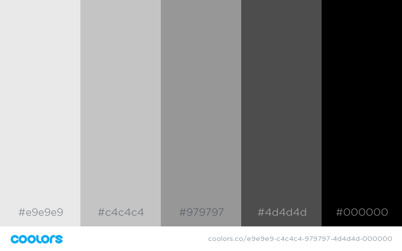
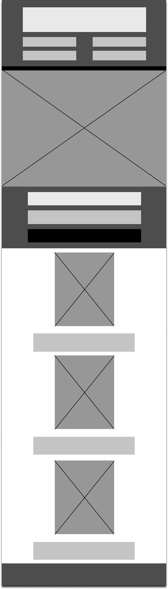
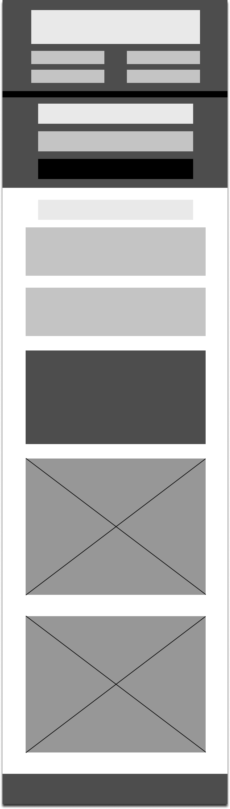
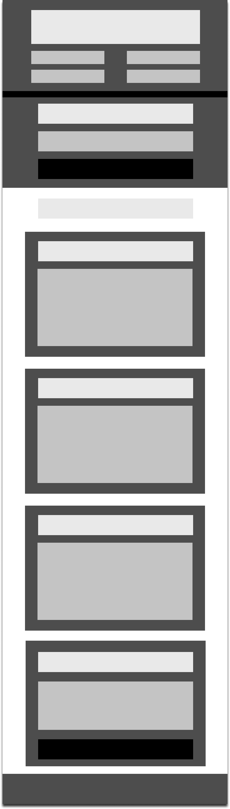
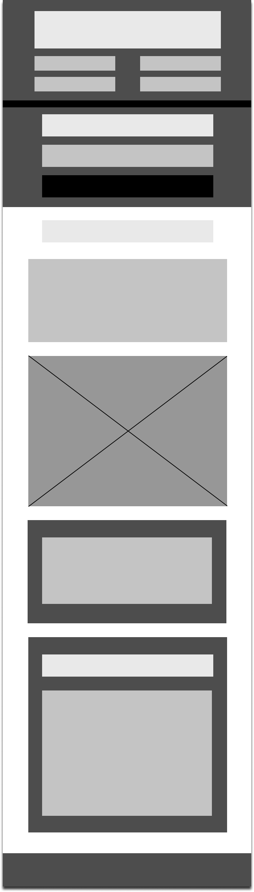
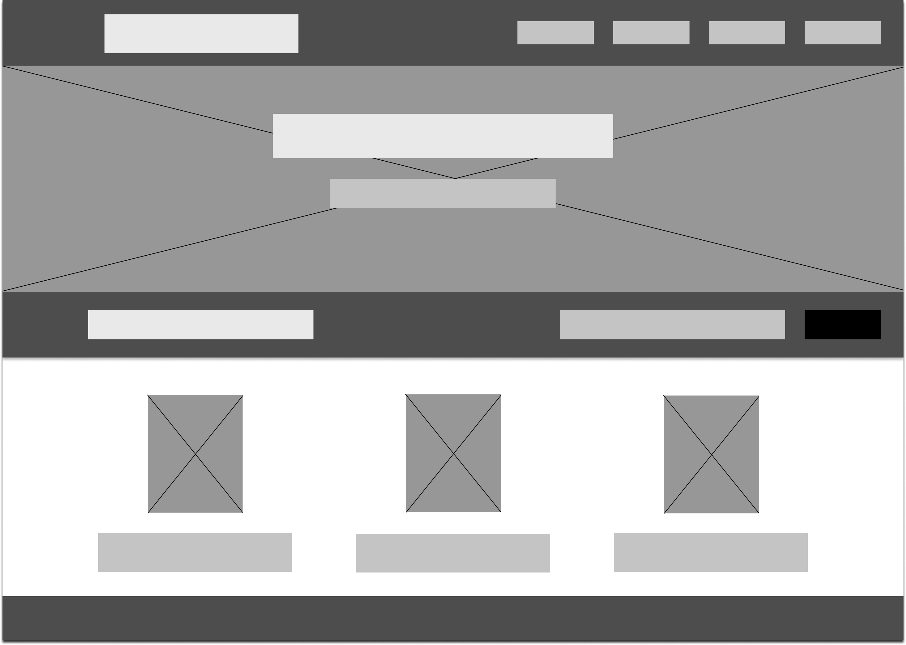
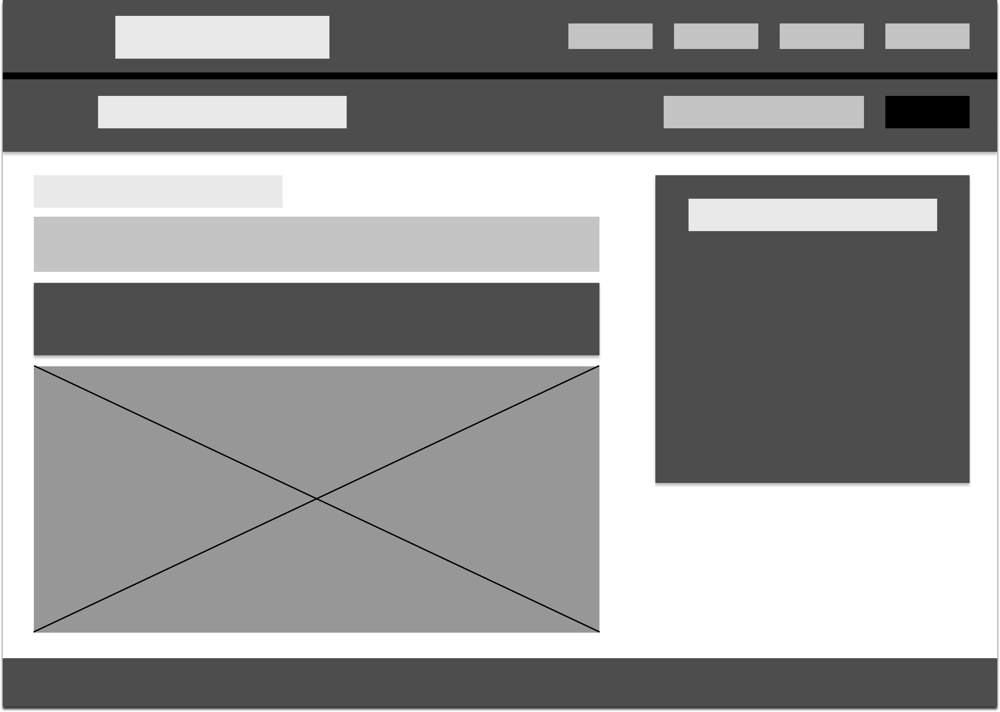
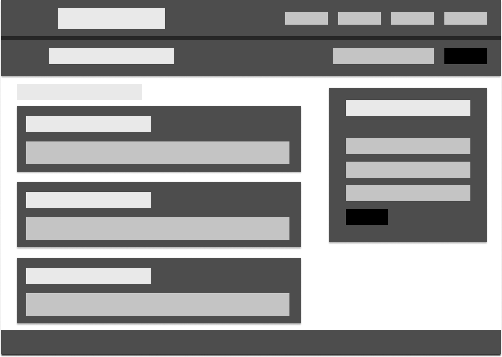
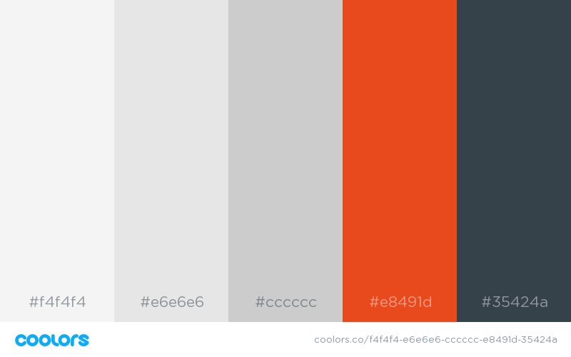

# My Personal Website
<h1> Introduction </h1>
Branding nowadays is very important and what better way to do that than build your own website. In order to promote myself, I chose to create a website with four pages. This document describes each step I took when creating the website. 
<h1> Low Fidelity Wire Frames </h1>
The development process started with the creation of the Website's Wire Frames. The goal of the Low Fidelity Wire Frames is to show how the website would look when finished. As I mentioned above, four pages were created - a ''Home'' page, an ''About'' page giving more information about who I am and what I do, a page that illustrates the services I offer as a Freelance Designer and Front-End Developer that I named ''Services'' and a ''Contact'' page, so future clients could get in touch with me. I used Figma when creating the Website's Wire Frames, mainly because I already have a lot of experience with this design tool and feel comfortable using it.  
I decided to work with a Web-safe Grayscale Color Palette in order to keep the Wire Frames as simple as possible. In the table below the image you can see which color was used for what part of the Website Wire Frames.

|Color Value| Used For|
|:----------|:--------|
|#e9e9e9    |headings |
|#c4c4c4    |text     |
|##979797   |images   |
|#4d4d4d    |sections |
|#000000    |buttons  |

Currently, all websites are expected to be Responsive, because they offer way more convenience. So when designing each Wire Frame, I was going for good user experience and no data difference between the Mobile and Desktop version of the Website. In addition, the approach I took while designing the Website Wire Frames was ''Mobile First''. The image below illustrates the Wire Frame for the ''Home'' page on a Mobile device. 

After that, the ''About'' page was created.

The third created Wire Frame was for the ''Services'' page. It included the three services I offer - logo design and redesign and website design.

And the last page was the ''Contact'' one. For this page I chose to add several social media icons and links to each of my profiles. In addition, when clicked, every link opens in a new window tab, so the person that is browsing my website does not have to waste time backtracking.  

After finish the Mobile Wire Frames, I moved to designing their Desktop version counterparts. Unlike the Mobile Wire Frames, I had way more real estate to work with, when designing the Desktop Wire Frames. I think I optimized the use of White Space on most pages quite well. The first created Desktop Wire Frame page was the ''Home'' one.

Followed by the About page. Just like its Mobile version, this page had images of a redesign I did on the Project Gutenberg website.

Again, Services was the third designed Wire Frame page.

And the last page was the Contact one.

Having finished the Website Wire Frames, I moved on to decide what Color Palette would fit the website. The thought behind choosing these colors, was that I wanted the website to look professional, yet energetic. I think the combination of colors offers exaclty that and still has a modern feel to it.

<h1> Evaluation </h1>
In conclusion, developing my personal website has definately helped me resolve some self promotional issues and has given me a boost in confidence. I strived to write organised and semantically correct code and I think I achieved that quite well. Nevertheless I encountered several problems along the way, one of which I could not solve. I did quite a lot of research, but still did not manage to increase the display time of the message from my JavaScript function. I tried adding a setTimeout() function to it, but I still couldn't get it to work. Even though this problem proved to be really tedious I will continue trying to find a way to resolve it. All other issues were rather minor, nothing a quick Google Search couldn't fix. This project really helped me broaden my horizon and put my skills to a test.

---

## Contributors

- Gencho N Apostolov <gencho.apostolov@gmail.com>

---

## License and Copyright

© Gencho N Apostolov

Licensed under the [MIT LICENSE](LICENSE).
