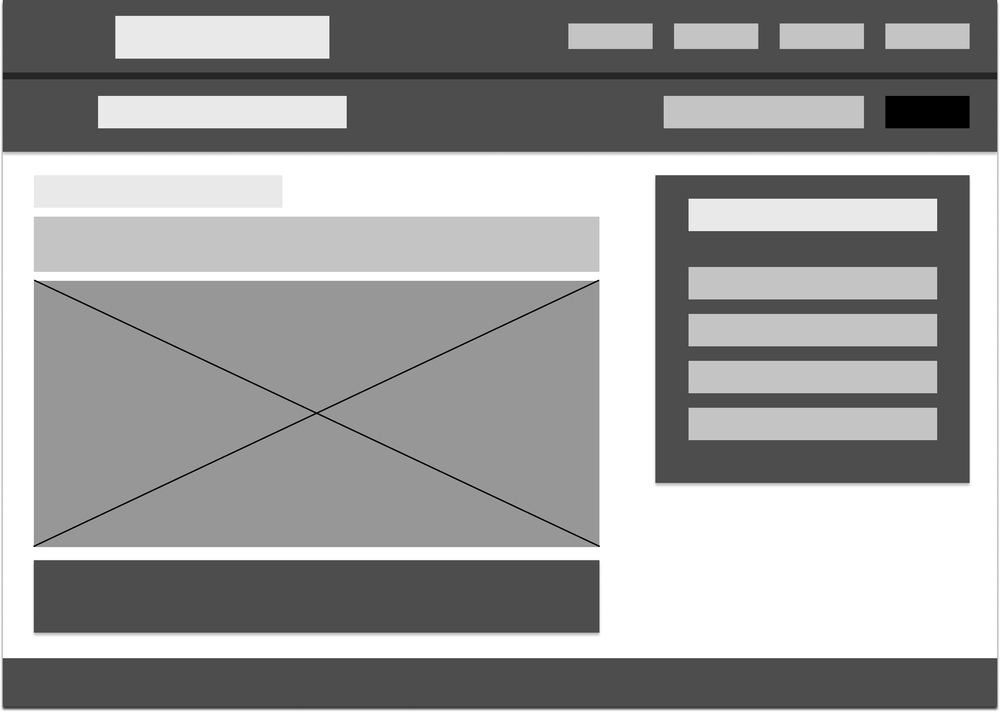

# My Personal Website
Branding nowadays is very important and what better way to do that than build your own website. In order to promote myself, I chose to create a website with four pages . A home page, an About page giving more information of who I am and what I do, a page that illustrates the services I offer as a Freelance Designer and Front-End Developer that I named Services and a Contact page, so future clients could get in touch with me.  
The development process started with the creation of the website's Wire Frames. The goal of the Low Fidelity Wire Frames is to show how the website would look when finished.  
I decided to work with a Web-safe Grayscale Color Palette in order to keep the Wire Frames as simple as possible. Below the image you can see which color was used for what part of the Website Wire Frames.

|Color Value| Used For|
|:----------|:--------|
|#e9e9e9    |headings |
|#c4c4c4    |text     |
|##979797   |images   |
|#4d4d4d    |sections |
|#000000    |buttons  |

The approach I took while designing the Website Wire Frames was Mobile First. The image below illustrates the Wire Frame for the Home page on a Mobile device. 

After that, the About page was created.

The third created Wire Frame was for the Services page.

And the last page was the Contact one.

After finish the Mobile Wire Frames, I moved to designing their Desktop version counterparts. The first one was again, the Home page.

Followed by the About page.

Again, Services was the third designed Wire Frame page.

And the last page was the Contact one.

Having finished the Website Wire Frames, I moved on to decide what Color Palette would fit the website. The thought behind choosing these colors, was that I wanted the website to look professional, yet energetic. I think the combination of colors offers exaclty that and still has a modern feel to it.

---

## Contributors

- Gencho N Apostolov <gencho.apostolov@gmail.com>

---

## License and Copyright

© Gencho N Apostolov

Licensed under the [MIT LICENSE](LICENSE).
